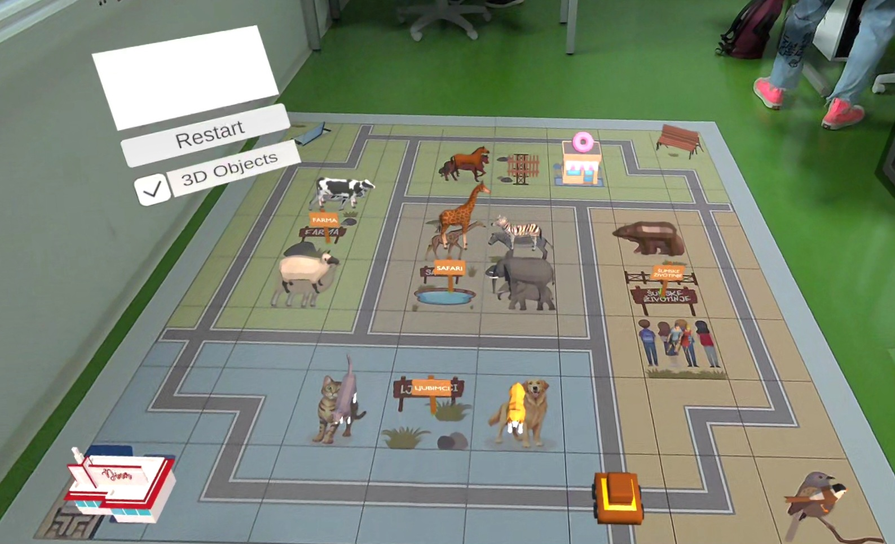
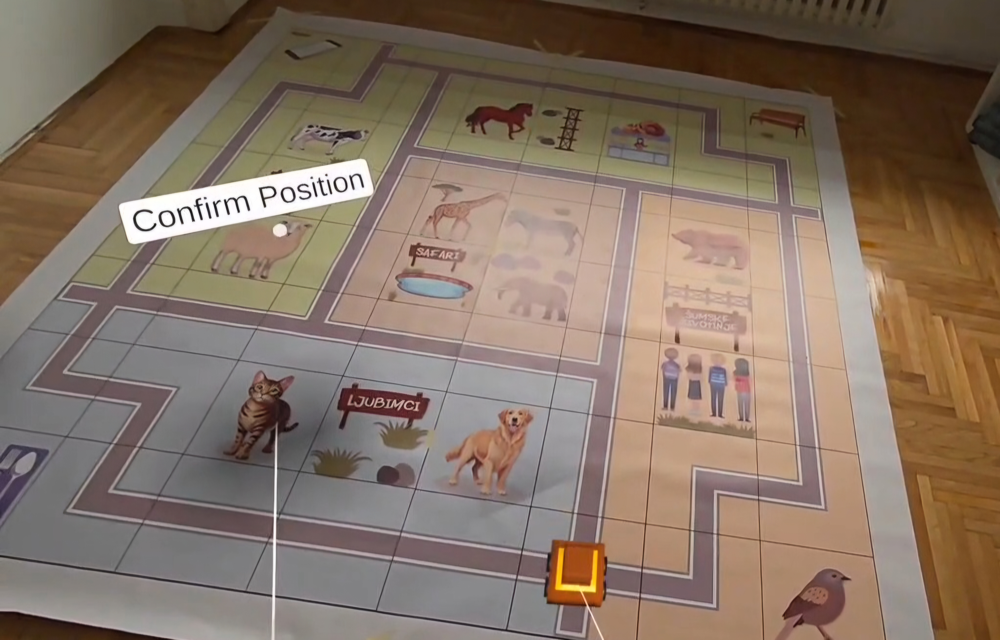
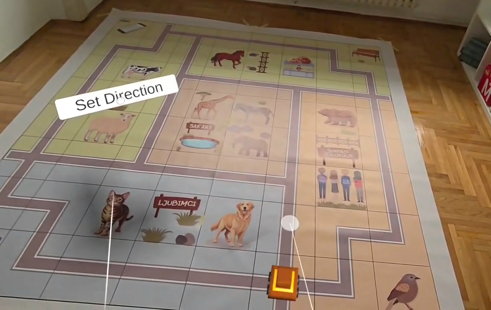

# Mixed Reality System for Simulation of Robot Movement

A mixed reality application for simulating robot movement using Python commands.

## About

Most primary school students learn programming without seeing a real-world use of their code. The MetaRoboLearn system lets students write Python code that drives a physical robot on a printed zoo map. This project adds mixed reality (MR): through Meta Quest 3 headsets, students see a virtual robot execute their code on the same physical map, surrounded by 3D animals and objects. Students stay aware of their real surroundings and can compare the ideal simulated robot with the real one.

## Features

- Manual calibration of the robot's position and direction using controllers
- 3D zoo that overlaps the illustrations on the physical map
- Custom interpreter for a subset of Python (lexer, parser, execution)
- Real-time command delivery from the MetaRoboLearn server over WebSocket
- Replicated object detection and robot display
- Runtime errors are reported to the server instead of crashing the app

## Architecture

The system works in two phases:

1. **Calibration and connection:** the user calibrates the robot, the 3D map is instantiated, the app requests a token via `POST /activate` and opens a WebSocket connection using that token.
2. **Command execution:** commands arrive as JSON and go through the lexer, parser and execution stages. Movement commands are executed on the virtual robot, `print` output goes to `POST /print`, and errors go to `POST /log`.

## Tech Stack

- Meta Quest 3 (Passthrough)
- Unity 6000.3.10f1, C#
- Meta XR All-In-One SDK 201.0.0
- XR Plugin Management 4.5.4
- Native WebSockets 2.0.4
- 3D models from Poly Pizza

## Calibration

Calibration uses the floor level detected by the environment scan (Effect Mesh) and has two steps:

1. **Position:** the right controller ray marks a spot on the floor and the robot is placed there. Confirm with `Confirm Position`.
2. **Direction:** the ray defines the robot's heading in the horizontal plane. Confirm with `Set Direction`.

  

QR code tracking was tried first but proved unreliable under varying lighting, so manual calibration was chosen.

## Interpreter

A custom interpreter was needed because Unity converts C# to C++ when building for Android (Meta Quest), which ruled out existing C# Python libraries.

**Supported:** variables, constants, `if`, `for i in range(N)`, `while`, functions, basic lists, robot movement commands (`forward`, `back`, `turn_left`, ...), display commands (`display_text`, `display_green`, ...) and object detection (`detect_object`, `detect_object_conf`).

**Limitations:** `and` / `or` precedence is not supported, indentation must be a tab or four spaces, and `while` loops are capped at 100 iterations.

## Testing

- **Calibration:** all scenarios passed. Small offsets on some 3D models were fixed by manual per-model adjustment.
- **Interpreter:** tested incrementally with normal, edge and intentional-error cases. An infinite `while` loop bug was found and fixed with the iteration limit.
- **User study:** 14 sixth-grade students (Likert scale 1-5).

| Statement | Mean | SD | Median |
|---|:---:|:---:|:---:|
| T1: Easy to learn to control the robot | 4.64 | 0.63 | 5 |
| T2: Enjoyed watching the robot run my code | 4.79 | 0.43 | 5 |
| T3: 3D animals made it more fun | 4.36 | 0.84 | 4.5 |
| T4: Would use the headset again | 4.64 | 0.74 | 5 |

## Getting Started

**Requirements:** Meta Quest 3 in developer mode, Unity 6000.3.10f1 with Android Build Support, and a robot registered on the MetaRoboLearn server (robot ID and API key).

> **Note:** Full functionality requires access to a MetaRoboLearn server and a registered robot (robot ID and API key), since the Python commands are delivered from the server. Without it, the app can be built and calibrated, but no code can be received or executed.

1. Clone the repository: `git clone https://github.com/IvanaVelickovic/mixed-reality-robot-sim/`
2. Open the project in Unity and make sure the required packages are installed.
3. Create a `Config` folder in `Assets` containing an `AppConfig` file with the fields `robotId`, `apiKey`, `baseUrl` and `wsUrl`. The folder is listed in `.gitignore` so credentials are not committed.
4. Build for Android (Meta Quest) and install on the headset.
5. Run the app, calibrate the robot and send code from the server.

## Future Work

- Support for other physical maps and themes
- A pure VR version without the physical map
- Extended interpreter (e.g. `and` / `or` precedence)

  
  
> This project was developed as part of a Bachelor's Thesis at the University of Zagreb, Faculty of Electrical Engineering and Computing (FER).
